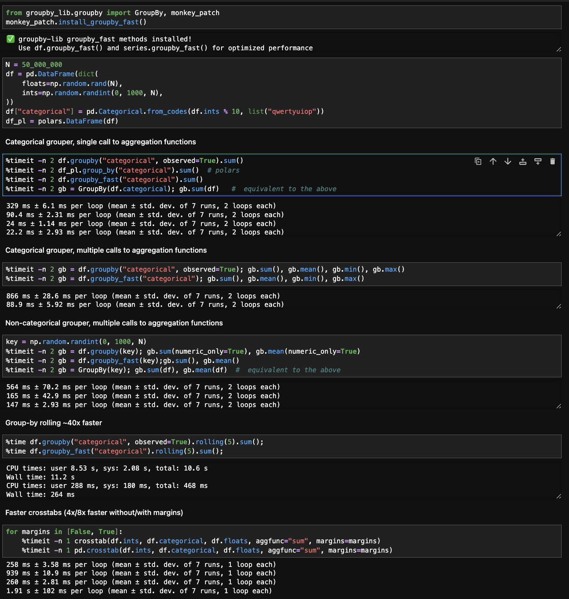
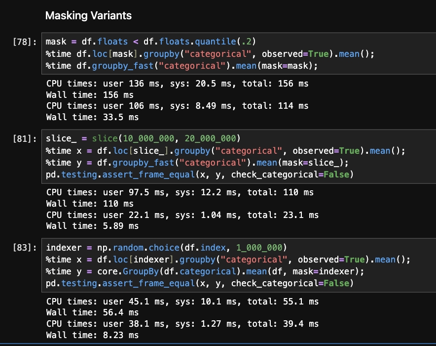
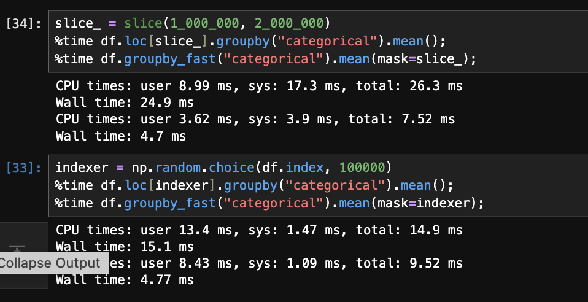
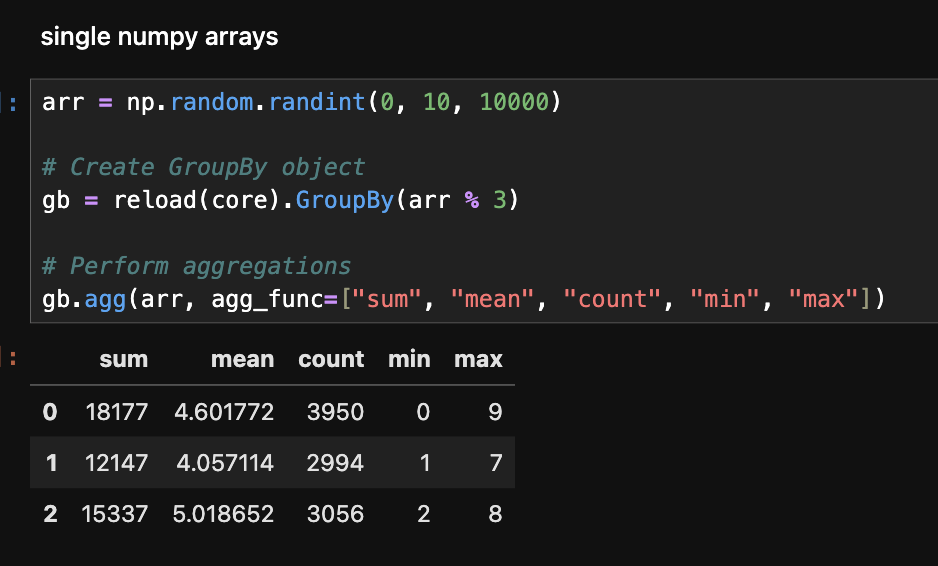

# pandas-plus

A high-performance extension package for pandas that provides fast groupby operations using NumPy and Numba acceleration intended for large data sets. Performance improvements increase as data is scaled up (see benchmarking below). It also provides a more flexible API and convenience methods in the group-by space like adding margins and calculating ratios. 

## Overview

```pandas-plus``` enhances Pandas groupby functionality with optimized implementations that leverage NumPy arrays and Numba's just-in-time compilation for significant performance improvements. The package is designed to work seamlessly with pandas DataFrames and Series while providing additional flexibility for various array types.


## Faster GroupBy Operations
Optimized group-by operations, particularly with categorical data (uses the existing factorization) and with multi-threading on large datasets across both row and columns axes



## Inline Filtering of Groupby Operations
 Inline filtering such that Series/DataFrames do not have to be filtered before group-by operations. Pass a Boolean mask, slice or fancy-indexer to the group-by method call:



- **Flexible Input Types**: Support for NumPy arrays, pandas Series/DataFrames backed by NumPy or Arrow, and Polars Series/DataFrames. Here are some examples which are not exhaustive

<!--  -->

```python
from pandas_plus.groupby import GroupBy

arr = np.random.randint(0, 10, 10000)
keys = arr % 3 + 2

# Create GroupBy object
gb = core.GroupBy(keys)

# Perform aggregations
gb.agg(arr, agg_func=["sum", "mean", "count", "min", "max"])
     sum      mean  count  min  max
2  18054  4.489928   4021    0    9
3  12085  4.035058   2995    1    7
4  14749  4.942694   2984    2    8

# on dict of arrays / Series
gb.std(dict(x=arr, x_squared=arr ** 2, pd_series=pd.Series(arr)))
           x	x_squared	pd_series
2	3.351510	31.601683	3.351510
3	2.452965	20.108977	2.452965
4	2.429882	24.677406	2.429882

# build a GroupBy from a dict/list of keys or a DataFrame
key_list = [keys, pd.Series(["A", "B"]).repeat(5000)]
GroupBy(key_list).size()
3  A    1537
   B    1497
2  A    2027
   B    1990
4  A    1436
   B    1513
```
- **Pandas Compatible**: Results are returned as pandas Series/DataFrames
- **Multi-threading**: Automatic parallelization for large datasets across both row and column axes

## Installation

```bash
# Install dependencies
conda install pandas-plus
```

## The GroupBy Class

The core of pandas-plus is the `GroupBy` class located in `pandas_plus.groupby.core`. This class provides efficient groupby operations with a pandas-like API.

### Basic Usage


### Supported Aggregation Methods

The GroupBy class supports various aggregation functions:

- `sum()/mean()` - Sum/mean of values in each group
- `min()/max()` - Min/Max value in each group
 - `var()/std()` - Variance/Std. Dev. of values in each group
- `count()` - Count of non-null values in each group
- `size()` - Total count of values in each group (including nulls)
- `median()` - Median value in each group

`GroupBy` also support cumulative group-by methods and rolling group-by methods

### Working with Pandas Data

```python
# Using pandas Series
df = pd.DataFrame({
    'category': ['A', 'B', 'A', 'C', 'B', 'A'],
    'value1': [1, 2, 3, 4, 5, 6],
    'value2': [10, 20, 30, 40, 50, 60]
})

# Group by category
gb = GroupBy(df['category'])

# Aggregate single column
mean_value1 = gb.mean(df['value1'])
print(mean_value1)
# Output:
# A    3.333333
# B    3.500000
# C    4.000000
# Name: value1, dtype: float64

# Aggregate multiple columns
result = gb.sum(df[['value1', 'value2']])
print(result)
# Output:
#    value1  value2
# A      10     100
# B       7      70
# C       4      40
```

### Multi-level Grouping

```python
# Group by multiple keys
keys1 = ['A', 'A', 'B', 'B', 'A', 'B']
keys2 = ['X', 'Y', 'X', 'Y', 'X', 'Y']
values = [1, 2, 3, 4, 5, 6]

gb = GroupBy([keys1, keys2])
result = gb.sum(values)
print(result)
# Output:
# A  X    6
#    Y    2
# B  X    3
#    Y   10
# dtype: int64
```

### Using Masks for Filtering

```python
# Apply mask to filter data during aggregation
keys = ['A', 'B', 'A', 'C', 'B', 'A']
values = [1, 2, 3, 4, 5, 6]
mask = np.array([True, False, True, True, False, True])

gb = GroupBy(keys)
result = gb.sum(values, mask=mask)
print(result)
# Output: Only includes values where mask is True
# A    10  # (1 + 3 + 6)
# C     4  # (4)
# dtype: int64
```

### Transform Operations

Transform operations return results with the same shape as the input:

```python
keys = ['A', 'B', 'A', 'B', 'A']
values = [1, 2, 3, 4, 5]

gb = GroupBy(keys)
transformed = gb.sum(values, transform=True)
print(transformed)
# Output: Each position shows the group sum
# 0    9  # Sum of group A
# 1    6  # Sum of group B  
# 2    9  # Sum of group A
# 3    6  # Sum of group B
# 4    9  # Sum of group A
# dtype: int64
```

### Generic Aggregation with agg()

```python
# Single aggregation function
gb = GroupBy(['A', 'B', 'A', 'B'])
result = gb.agg([1, 2, 3, 4], 'mean')

# Multiple aggregation functions
result = gb.agg([1, 2, 3, 4], ['sum', 'mean', 'min', 'max'])
print(result)
# Output:
#    sum  mean  min  max
# A    4   2.0    1    3
# B    6   3.0    2    4
```

### Ratio Calculations

```python
# Calculate ratios between two value sets
numerator = [1, 2, 3, 4]
denominator = [10, 20, 30, 40]
keys = ['A', 'B', 'A', 'B']

gb = GroupBy(keys)
ratio = gb.ratio(numerator, denominator)
print(ratio)
# Output:
# A    0.133333  # (1+3)/(10+30)
# B    0.100000  # (2+4)/(20+40)
# dtype: float64
```

### Head Operation

Get the first n rows from each group:

```python
keys = ['A', 'A', 'B', 'B', 'A', 'B']
values = [1, 2, 3, 4, 5, 6]

gb = GroupBy(keys)
first_two = gb.head(values, n=2)
print(first_two)
# Output: First 2 values from each group
# A  0    1
#    1    2
# B  0    3
#    1    4
# dtype: int64
```

### Pivot Tables

Create pivot tables using the pivot_table function:

```python
from pandas_plus.groupby.core import pivot_table

# Sample data
index_keys = ['Jan', 'Feb', 'Jan', 'Feb']
column_keys = ['A', 'A', 'B', 'B']  
values = [10, 20, 30, 40]

result = pivot_table(
    index=index_keys,
    columns=column_keys,
    values=values,
    agg_func='sum'
)
print(result)
# Output:
#      A   B
# Feb  20  40
# Jan  10  30
```

## Performance Benefits

pandas-plus provides significant performance improvements for large datasets:

- **Numba Acceleration**: JIT compilation for fast numerical operations
- **Multi-threading**: Automatic parallelization for datasets > 1M rows
- **Memory Efficiency**: Optimized memory usage patterns
- **Reduced Overhead**: Minimal pandas overhead for core operations

## Dependencies

- Python 3.10+
- NumPy
- pandas
- numba
- pyarrow
- polars (optional, for polars Series support)

## Development

See [CLAUDE.md](CLAUDE.md) for development guidelines including:
- Code style conventions
- Testing requirements
- Build and lint commands
- Contribution guidelines
